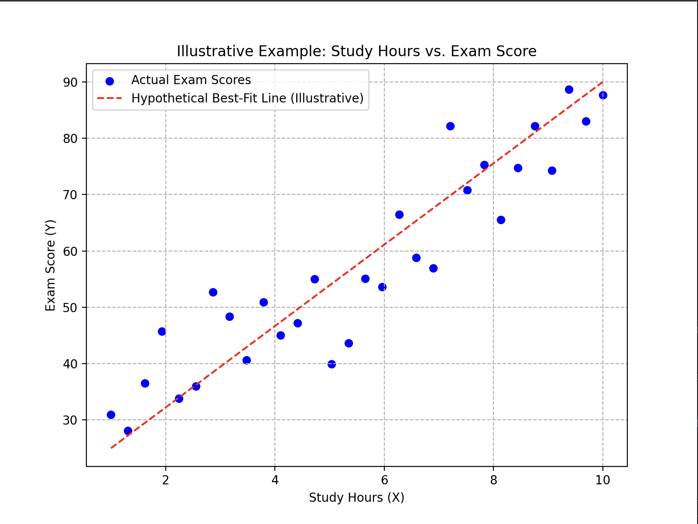
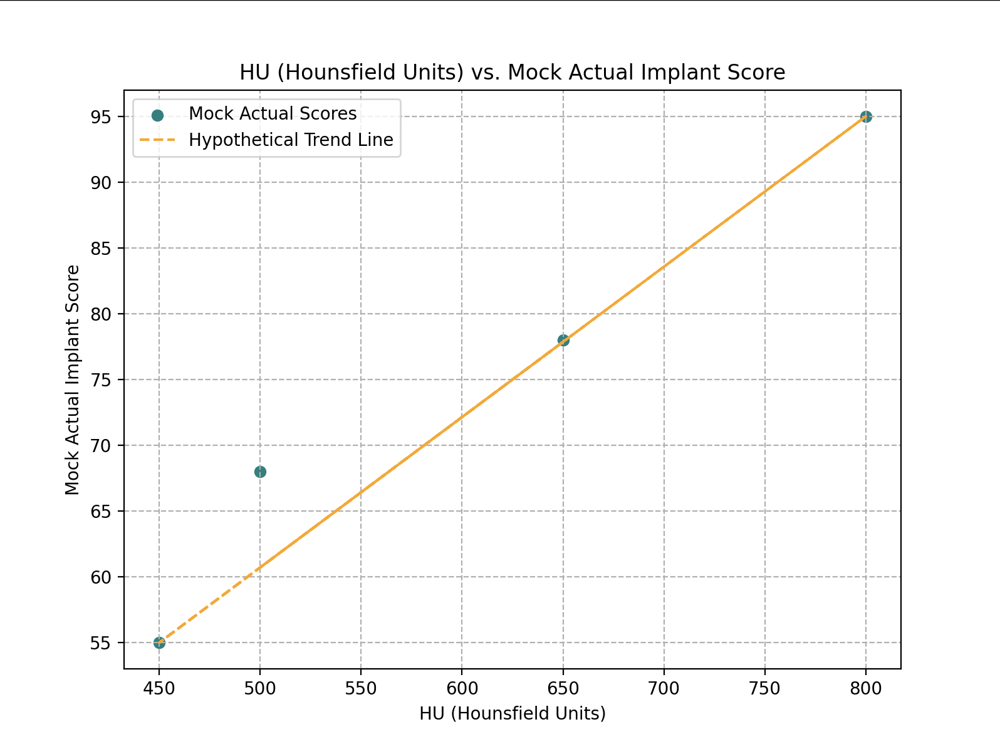
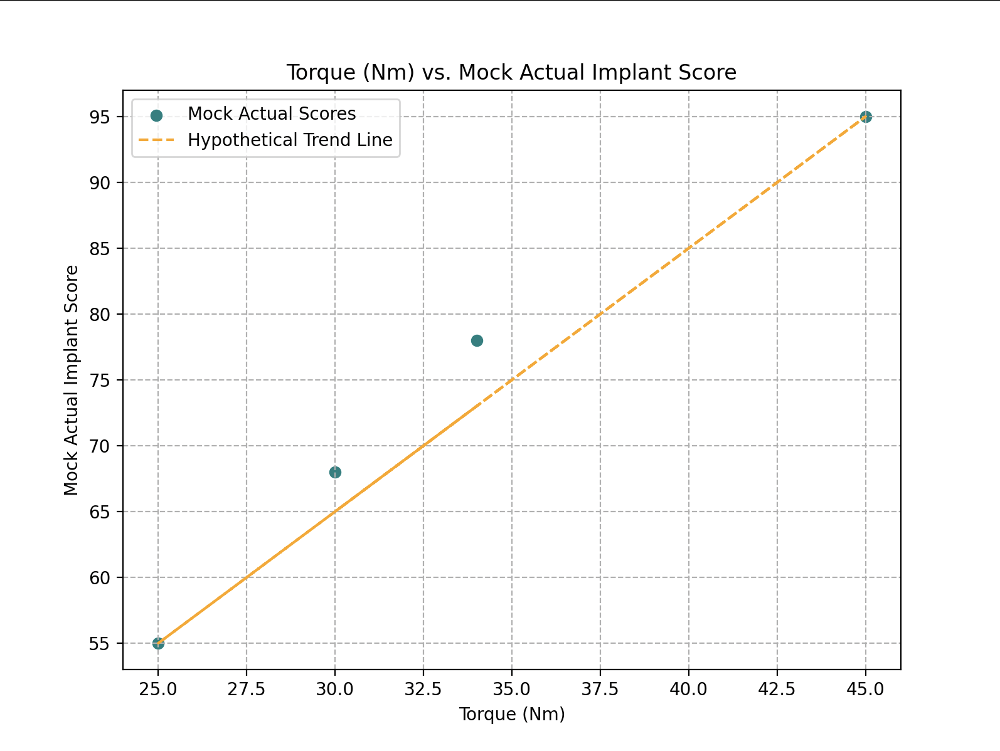
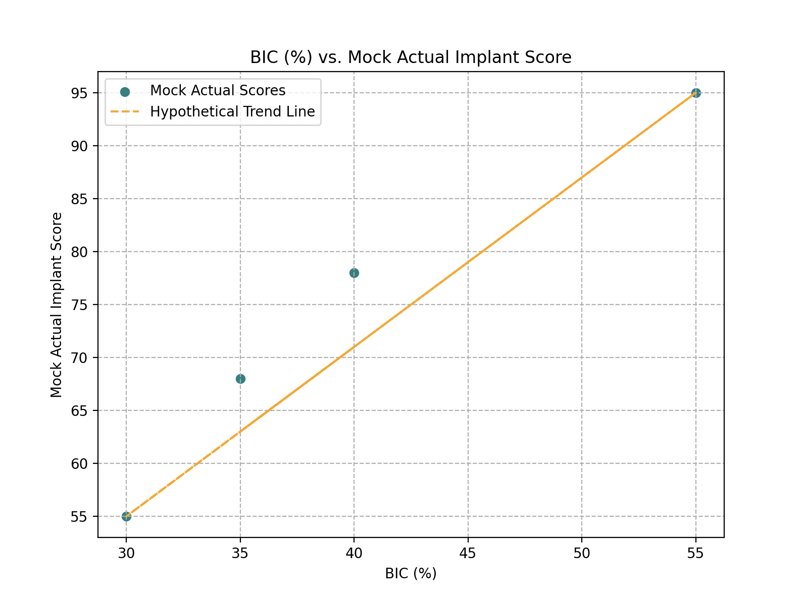
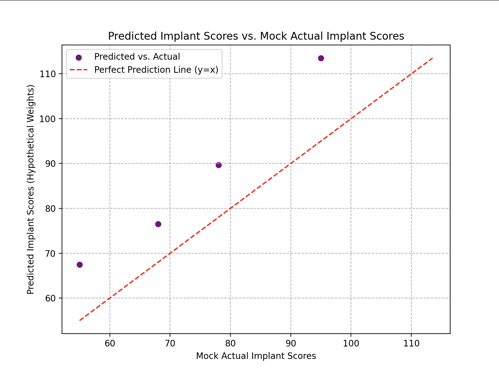
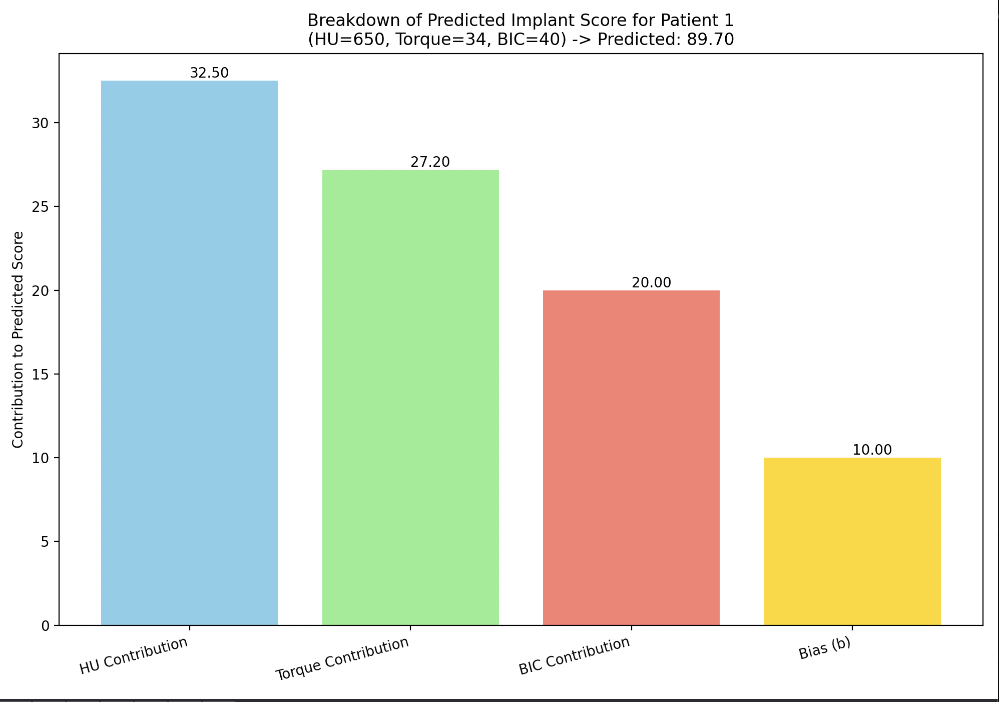
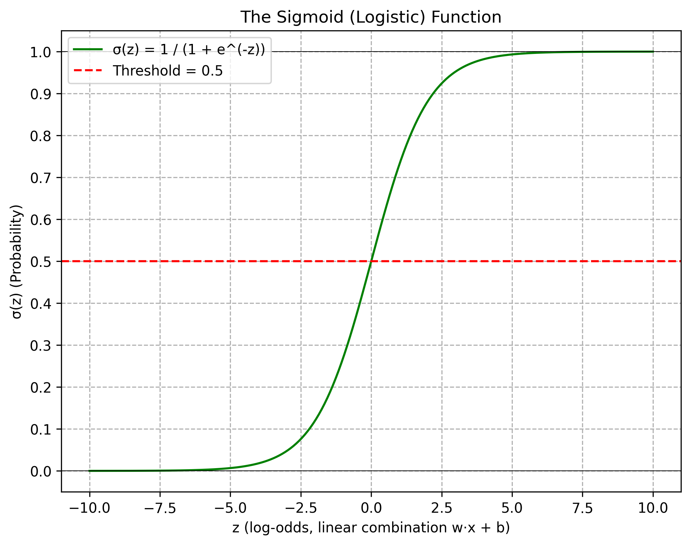

# Chapter 3: Fundamental Algorithms - Linear Regression

This section of the repository explores fundamental machine learning algorithms, starting with Linear Regression, based on Chapter 3 of "The Hundred-Page Machine Learning Book" by Andriy Burkov and supplemented with practical examples and visualizations.

## 1. Introduction to Linear Regression (`linear_regression_intro_demo.py`)

This script serves as an initial exploration of Linear Regression, focusing on core concepts, notation, the model equation, and the Mean Squared Error (MSE) objective function. It heavily utilizes print statements for explanations and `matplotlib` for visualizations.

### Key Concepts Covered:

*   **What is Linear Regression?**
    *   Predicts a continuous numerical value (Y) from input features (X).
    *   Models Y as a linear function: `Y <- ƒ_w,b(X)`.
    *   Aims to find the best "straight-line" or "flat-plane/hyperplane" that minimizes distances to data points.
    *   Generally robust against overfitting.
    *   Includes a dental application teaser: predicting implant success scores from features like Surface Sa, ISQ, and BIC.

*   **Data and Notation:**
    *   **Dataset:** Represented by an N x D matrix `X` (N samples, D features) and an N x 1 vector `Y` (target values).
    *   **Feature Vector `X_i`**: A single row in `X`, representing one sample's features.
    *   Examples are provided for `X` and `Y` matrices using mock dental data.

*   **The Model: Linear Regression Equation:**
    *   Formula for one sample `X_i`: `ƒ_w,b(X_i) = w · X_i + b`
        *   `w`: Vector of weights (one per feature).
        *   `b`: Bias term (scalar intercept).
        *   `w` and `b` are learned during training.
    *   **Objective Function (Loss Function): Mean SquaredError (MSE)**
        *   Formula: `MSE = (1/N) * Σ_i (ƒ_w,b(X_i) - Y_i)^2`
        *   Measures the average squared difference between predicted and actual values.
        *   Training aims to find `w` and `b` that minimize MSE.
        *   Reasons for using squared difference (emphasizes large errors, convex, mathematically convenient) are discussed.

*   **Detailed Dental Example (Predicting Implant Score):**
    *   Features: Hounsfield Units (HU), Torque, Bone-Implant Contact (BIC).
    *   Hypothetical weights and bias are used to demonstrate prediction.
    *   **Mock Dental Data:** Four patient samples with HU, Torque, BIC values, and corresponding mock "actual" implant scores.
    *   **Prediction Calculation:** For each mock patient, the script calculates:
        *   The individual contribution of each weighted feature (e.g., `w_Hu * HU_value`).
        *   The final predicted implant score.
    *   **Weight Interpretation & Feature Scaling:**
        *   A critical discussion on why direct comparison of raw weight magnitudes can be misleading if features are not on similar scales.
        *   An illustrative example with "Feature A" (small scale) and "Feature B" (large scale) demonstrates how a feature with a smaller weight can have a larger impact if its numerical values are much larger. This highlights the necessity of feature scaling (e.g., Standardization) before training if one wishes to interpret weights as indicators of feature importance.

### Visualizations in `linear_regression_intro_demo.py`:

The script includes several plots to aid understanding:

1.  **Illustrative Example: Study Hours vs. Exam Score:**
    *   **Purpose:** To provide a simple, intuitive 1D visualization of what linear regression tries to achieve.
    *   **Content:** A scatter plot of synthetic data (Study Hours vs. Exam Score) showing a positive linear trend. A hypothetical "best-fit" line is overlaid to illustrate the target of the regression.
    *   Study Hours vs. Exam Score:
        

2.  **Individual Dental Features vs. Mock Actual Implant Score (3 Plots):**
    *   **Purpose:** To visually inspect the relationship between each individual dental feature (HU, Torque, BIC) from the mock data and the mock actual implant scores.
    *   **Content:** Three separate scatter plots:
        *   HU vs. Mock Actual Score
        *   Torque vs. Mock Actual Score
        *   BIC vs. Mock Actual Score
    *   Each plot includes a hypothetical trend line to suggest the linear relationship the model might try to capture for that feature in isolation.
    *   HU vs. Actual Score:
        
    *   Torque vs. Actual Score:
        
    *   BIC vs. Actual Score:
        

3.  **Predicted Implant Scores vs. Mock Actual Implant Scores:**
    *   **Purpose:** To visually assess how well the predictions (made using the *hypothetical* weights) align with the mock actual scores.
    *   **Content:** A scatter plot with mock actual scores on the x-axis and the predicted scores on the y-axis. A 45-degree (y=x) "Perfect Prediction Line" is included as a reference. Deviations from this line represent prediction errors.
    *   Predicted vs. Actual Scores:
        

4.  **Breakdown of Predicted Implant Score (Bar Chart):**
    *   **Purpose:** To clearly show how individual feature contributions and the bias term add up to form the final predicted score for a specific patient.
    *   **Content:** A bar chart for the first mock dental patient, where each bar represents the magnitude of:
        *   HU Contribution (`w_Hu * HU_value`)
        *   Torque Contribution (`w_Torque * Torque_value`)
        *   BIC Contribution (`w_BIC * BIC_value`)
        *   Bias (`b`)
    *   The numerical value of each component is displayed on its bar.
    *   Contribution Breakdown for Patient 1:
        

This script and its explanations serve as the foundational step for understanding Linear Regression before moving on to topics like training algorithms (e.g., Gradient Descent, Normal Equation), model evaluation, and more advanced considerations.

## 4. Training the Model: Finding the Best Parameters 🏋️‍♂️

*   **Goal of Training:** The primary goal of training a linear regression model is to find the optimal numerical values for the weights (`w`) and the bias (`b`) that minimize the model's prediction error on the training dataset.

*   **The Loss Function (Objective Function):**
    *   This function quantifies how well the model's predictions match the actual outcomes.
    *   **Squared Error (Loss for a single observation):** For a single data point `(xi, yi)`, the squared error is `(ƒw,b(xi) - yi)²`. This measures the discrepancy for one prediction.
    *   **Mean Squared Error (MSE - Loss for the entire dataset):** To evaluate the model over the entire dataset of `n` observations, the Mean Squared Error is typically used: `MSE = (1/n) * Σ_i (y_i - ŷ_i)²` (where `ŷ_i` is the prediction `ƒw,b(xi)`). This averages the squared errors across all observations.
    *   The script `linear_regression_intro_demo.py` already introduces MSE as the objective function.

*   **Minimizing the Loss:**
    *   The training process employs optimization algorithms (like Gradient Descent or analytical methods like the Normal Equation) to iteratively adjust `w` and `b`.
    *   The aim is to find the parameter values that lead to the minimum possible value of the chosen loss function (e.g., MSE).
    *   For algorithms like Gradient Descent, this involves calculating the gradient (slope) of the loss function with respect to the parameters and updating the parameters in the opposite direction of the gradient to move towards the minimum.
    *   The process continues until the parameters converge to values that result in the lowest prediction error, or a predefined stopping criterion is met.

## 5. Using the Model: Prediction Phase 🔮

*   Once the training process is complete, the model has determined the optimal (or learned) weights and bias. Let's call these `w_learned` and `b_learned`.
*   These learned parameters are now fixed values that define our specific linear regression model.
*   **Making Predictions:** To predict the outcome for a new, unseen input feature vector `x_new`, we simply plug it into the model's equation:
    *   If `x_new = (feature1_new, feature2_new, feature3_new, ..., featureD_new)`
    *   The prediction `ypredicted_new` is calculated as:
        `ypredicted_new = (feature1_new * w_learned1 + feature2_new * w_learned2 + ... + featureD_new * w_learnedD) + b_learned`
    *   This can be written more compactly using vector notation: `ypredicted_new = x_new · w_learned + b_learned`

*   **Dental Example (Predicting Marginal Bone Loss - MBL):**
    *   Assume a model is trained to predict MBL (e.g., in mm, scaled) one year after implant placement.
    *   Input features measured during placement: HU, Torque, ISQ.
    *   Hypothetical learned parameters after training:
        *   `w_torque_learned = 0.2`
        *   `w_hu_learned = 0.3`
        *   `w_isq_learned = 0.4`
        *   `b_learned = 12`
    *   New implant scenario data:
        *   `Torque_new = 30 Nm`
        *   `HU_new = 450`
        *   `ISQ_new = 80`
    *   Prediction calculation:
        `MBL_predicted = (0.2 * 30) + (0.3 * 450) + (0.4 * 80) + 12`
        `MBL_predicted = 6 + 135 + 32 + 12 = 185`
    *   Interpretation: This predicted value of 185 might represent, for example, 1.85 mm of bone loss if an agreement was made to scale the prediction output by a factor of 100 during modeling.
    *   *(This example is also conceptually demonstrated in `linear_regression_intro_demo.py`)*

## 6. Important Considerations & Potential Confusing Points 🤔

*   **Linearity Assumption:** Linear regression fundamentally assumes a linear relationship between the input features (X) and the output variable (Y). If this relationship is non-linear, the model's predictions may be inaccurate. 
    *   **Addressing Non-linearity:** Non-linearity can be addressed by transforming features (e.g., polynomial features like X², X³), or by using more complex models like polynomial regression, decision trees, or neural networks that can inherently capture non-linear patterns. For instance, the relationship between insertion torque and MBL might be linear up to a point, but excessive torque could lead to a much more pronounced MBL (a threshold effect).

*   **Independence of Errors (Residuals):** The errors, calculated as `yi - ƒw,b(xi)`, should be independent of each other. There should be no discernible patterns when plotting residuals against predicted values or independent variables. Patterns might suggest that the model is missing some information or that a different model structure is needed.

*   **Homoscedasticity (Constant Variance of Errors):** This assumption states that the variance (spread) of errors should be constant across all levels of the independent features. 
    *   **Heteroscedasticity:** If this assumption is violated (i.e., the variance of errors changes with the level of features), it's called heteroscedasticity. This can lead to inefficient parameter estimates and biased standard errors, affecting the reliability of hypothesis tests and confidence intervals about the model parameters.

*   **Feature Scaling:** (Reiterated from earlier, crucial for weight interpretation)
    *   When interpreting the learned weights (`w`) to gauge feature importance (e.g., `w_torque = 0.4` vs. `w_isq = 0.2`), direct comparison is misleading if features are not on similar numerical scales. A feature with a large raw value might have a small weight but still contribute significantly, and vice-versa. Always scale/standardize features before training if you intend to compare weights for importance.

*   **Multicollinearity:** This occurs when independent features in the model are highly correlated with each other (i.e., they provide redundant information). 
    *   **Impact:** Multicollinearity makes it difficult to determine the individual impact of each correlated feature on the dependent variable. The estimated weights can become unstable and have high standard errors, making interpretations unreliable. For example, implant length and implant width are likely to be correlated; if both are included, it's hard to isolate their individual effects.

*   **Overfitting:** While linear regression is generally less prone to overfitting than more complex models, it *can* overfit, especially if:
    *   There are too many features (high D) for a small number of samples (N).
    *   Polynomial features or interaction terms are added excessively without proper regularization techniques (like L1 or L2 regularization, which penalize large weights).

*   **Features vs. Parameters:**
    *   **Features (X):** These are the input variables or attributes used by the model to make predictions (e.g., HU, Torque, ISQ).
    *   **Parameters (w, b):** These are the values the model learns from the data during the training process. In linear regression, these are the weights and the bias. They define the specific line/plane the model uses. (Note: In other models like SVM, hyperparameters like `C` and `gamma` are set *before* training and are not learned parameters in the same way as `w` and `b`.)

*   **Interpretation of Weights (again, with caveats):**
    *   Weights indicate the change in the predicted outcome for a one-unit change in the corresponding feature, *assuming all other features are held constant*. However, this interpretation is most reliable when features are scaled and multicollinearity is low. High weights don't always mean highest influence if scaling is ignored or strong correlations exist.

*   **Correlation vs. Causation:** A fundamental principle in statistics. Finding a strong correlation between two variables using linear regression (or any statistical method) does *not* imply that one variable causes the other. There might be a confounding variable, or the relationship could be coincidental. Example: Ice cream sales and temperature are correlated, but ice cream sales don't cause temperature changes.

## 7. Dental Applications & Examples Summarized 🦷

Linear regression can be applied to various predictive tasks in dentistry. Throughout the explanations, we've touched upon examples like:

*   Predicting Marginal Bone Loss (MBL) based on features like Torque, HU, and ISQ at implant placement.
*   Predicting implant success scores (a continuous measure) after a certain follow-up period using baseline features.
*   Potentially modeling the relationship between patient factors (age, health status, smoking habits) and long-term (e.g., 10-year) implant success metrics.

## 8. Strengths & Weaknesses of Linear Regression 💪

### Strengths:

*   **Simplicity and Interpretability:** The model is relatively easy to understand, implement, and its results (coefficients, if features are scaled and assumptions met) can be interpretable.
*   **Computational Efficiency:** Training is generally fast, especially with analytical solutions (Normal Equation) or efficient optimization algorithms. It scales well to large datasets for basic linear regression.
*   **Good Baseline Model:** Often used as an initial model to establish a performance baseline before trying more complex algorithms. It provides a quick insight into potential linear relationships.
*   **Less Prone to Overfitting (in its basic form):** Compared to complex models, simple linear regression has fewer parameters and is less likely to overfit, especially with a reasonable amount of data.

### Weaknesses:

*   **Linearity Assumption:** Its primary limitation. If the true relationship between features and the target is non-linear, linear regression will provide a poor fit and inaccurate predictions.
*   **Sensitivity to Outliers:** Because MSE squares the errors, outliers (data points far from the general trend) can disproportionately influence the learned regression line, pulling it towards them and potentially misrepresenting the true underlying relationship.
*   **Assumes No Multicollinearity (for reliable interpretation):** High correlation between independent features makes it difficult to isolate the individual effect of each feature, leading to unstable and unreliable coefficient estimates.
*   **Assumes Homoscedasticity (for valid inferences):** If the variance of errors is not constant across feature values (heteroscedasticity), the standard errors of the coefficients can be biased, affecting hypothesis tests and confidence intervals about the parameters.
*   **Performance Limits:** While a good starting point, its simplicity means it may not capture complex patterns in data where more sophisticated models might perform better. Its performance is highly dependent on its assumptions being met.

## 2. Introduction to Logistic Regression (`logistic_regression_intro_demo.py`)

This script begins our exploration of Logistic Regression, a fundamental algorithm for binary classification problems.

### Key Concepts Covered (Initial):

*   **What is Logistic Regression?**
    *   **General Idea:** Classifies input data into one of two categories (e.g., Success/Failure, Risky/Not Risky) by predicting the probability of belonging to a particular class.
    *   **Core Concept:** It first calculates a linear score (z-score: `z = w · x + b`), just like linear regression. This score is then passed through the **Sigmoid function** (`σ(z) = 1 / (1 + e^(-z))`), which squashes the output to a probability between 0 and 1. A threshold (commonly 0.5) is used on this probability to make the final classification.
    *   **Dental Example Teaser:** Predicting implant success (1) or failure (0) based on Torque and ISQ, demonstrating the z-score and sigmoid calculation.

*   **Data and Notation:**
    *   The target variable `yi` in the dataset `{(xi, yi)}` is a binary categorical label (typically 0 or 1).
    *   The model aims to predict `pi`, the probability of `yi` being 1.

*   **The Model: Logistic Regression Formulas:**
    *   **Prediction:** Involves calculating the z-score and then applying the Sigmoid function.
    *   **Loss Function (for Training): Binary Cross-Entropy (BCE) Loss:**
        *   Formula: `L(y, p) = - [y * log(p) + (1 - y) * log(1-p)]` (where `y` is true label, `p` is predicted probability for class 1).
        *   This function penalizes the model based on how far its predicted probabilities are from the actual binary labels. The script explains its behavior when `y=1` (loss is `-log(p)`) and when `y=0` (loss is `-log(1-p)`).

*   **Visualization:**
    *   The script now includes a plot of the **Sigmoid function**, illustrating how it maps any real-valued z-score to a probability between 0 and 1. This plot also shows the placement of the three dental examples (High P, Low P, Mid P) on the curve, visualizing their respective z-scores and resulting probabilities. This is saved to `plots/chapter_3/logistic_regression/sigmoid_function_plot.png`.
    *   Sigmoid Function Plot with Dental Examples:
        
    *   **Binary Cross-Entropy (BCE) Loss Plots:** Two plots are generated to visualize the BCE loss behavior:
        *   **Case 1 (True Label y = 1):** Shows `Loss = -log(p)` vs. `p` (predicted probability for class 1). Illustrates how loss increases as `p` deviates from 1. Saved to `plots/chapter_3/logistic_regression/bce_loss_y_equals_1.png`.
        *   BCE Loss (y=1):
            
        *   **Case 2 (True Label y = 0):** Shows `Loss = -log(1-p)` vs. `p` (predicted probability for class 1). Illustrates how loss increases as `p` deviates from 0 (meaning `1-p` deviates from 1). Saved to `plots/chapter_3/logistic_regression/bce_loss_y_equals_0.png`.
        *   BCE Loss (y=0):
            

*(This script is a work in progress, with further sections on training, detailed prediction, considerations, strengths, and weaknesses to be added based on ongoing study.)*

